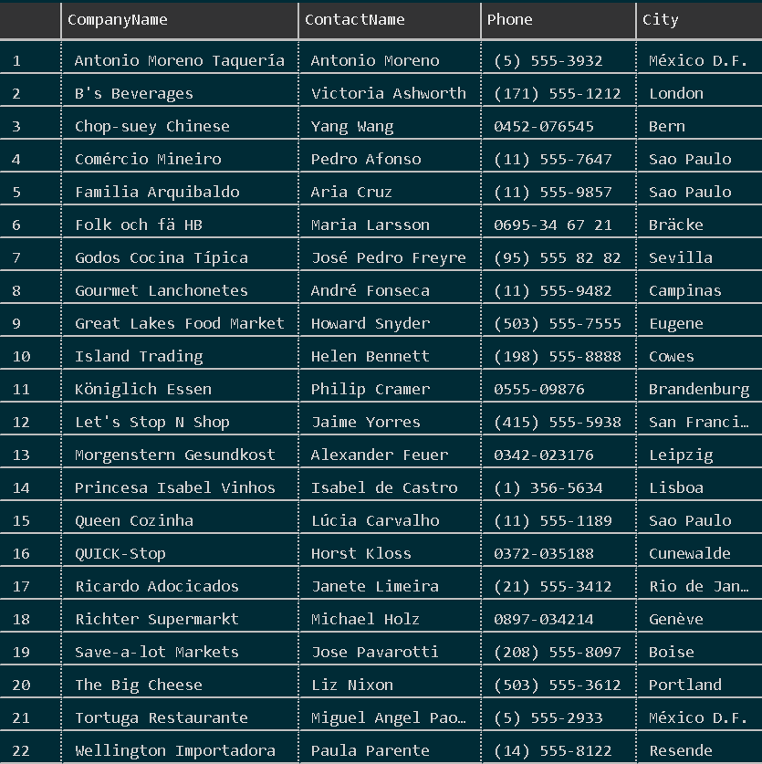
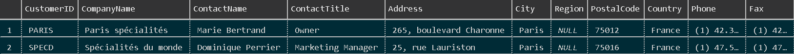
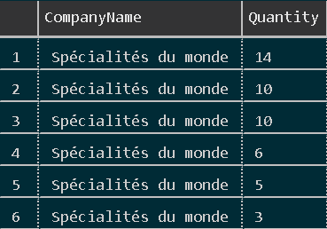
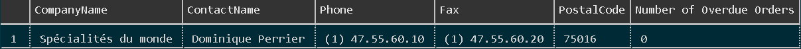

# SQL Queering Homework 
__Note__ : Where the response says 'N/A' this means the output was a long table, and not a short answer. 


1. How many orders in NWDB?

Query:
```sql
SELECT COUNt(*) FROM orders;
```

Response: 830

2. How many order that the Ship City is Rio de Janeiro?
Query:
```sql
SELECT COUNT(*) FROM Orders WHERE ShipCity = 'Rio de Janeiro';
```

Response: 34

3. Select all orders that the Ship City is Rio de Janeiro or Reims?

Query:
```sql
SELECT * FROM Orders WHERE ShipCity IN ('Rio de Janeiro', 'Reims');
```

Response: N/A

4. Select all of the entries where the Company name has a z or a Z in the table of Customers

Query:
```sql
SELECT * FROM Customers WHERE CompanyName LIKE '%z%';
```

Response: N/A

5. We need to update all of our FAX information! This Day and age it is a must! 😅😅😅 Find me the Name of All of the companies that we do not have their FAX numbers! I would also like to know with whom I need to speak with, their contact numbers and what city they are base in.

Query:
```sql
SELECT CompanyName, ContactName, Phone, City FROM Customers WHERE Fax IS NULL;
```


Response:




6. Ahh there you are! My prize ⭐⭐SPARTANTS⭐⭐! MY MARES AND MY STALLIONS! We need to re-target all of our Customers is Paris! Get me information on these clients.
Query:
```sql
SELECT * FROM Customers WHERE City = 'Paris';
```

Response:



7. WAIT! Where are you going? (...) These clients are hard to sell too! We need more intel.. Can you find out, from these clients from Paris, whom orders the most by quantity? Who are our top 5 clients?

Query:
```sql
-- There are only two clients from Paris, so no need for the TOP 5 part
SELECT Customers.CompanyName, [Order Details].Quantity
FROM((Orders
INNER JOIN Customers ON Orders.CustomerID = Customers.CustomerID)
INNER JOIN [Order Details] ON Orders.OrderID = [Order Details].OrderID) 
WHERE Customers.City = 'Paris'
ORDER BY Quantity DESC;
```

Response:
'Specialites du Monde' is our biggest client from Paris, in fact the other client has never made an order. 



8. OMG What are you? Some kind of SQL Guardian Angel? THIS IS AMAZING! May God pay you handsomely 😸 because I have no cash on me!.. I do have one more request. I need to know more about these these Paris client. Can you find out which ones their deliveries took longer than 10 days? Display the Business/client name, contact name, all their contact details (don't forget the fax!), as well as the number of deliveries that where overdue! Just add a column named: 'Number overdue orders'! simple, thank you!

Query:
```sql
SELECT  Customers.CompanyName, 
        Customers.ContactName,
        Customers.Phone,
        Customers.Fax,
        Customers.PostalCode,
        SUM(CASE WHEN DATEDIFF(DAY,Orders.RequiredDate, Orders.ShippedDate)>10 THEN 1 ELSE 0 END)
        AS 'Number of Overdue Orders'
FROM  ((Orders
INNER JOIN Customers ON Orders.CustomerID = Customers.CustomerID)
INNER JOIN [Order Details] ON Orders.OrderID = [Order Details].OrderID) 
WHERE Customers.City = 'Paris'
GROUP BY    Customers.CustomerID,
            Customers.CompanyName,
            Customers.ContactName,
            Customers.Phone,
            Customers.Fax,
            Customers.PostalCode;
```

Response:

